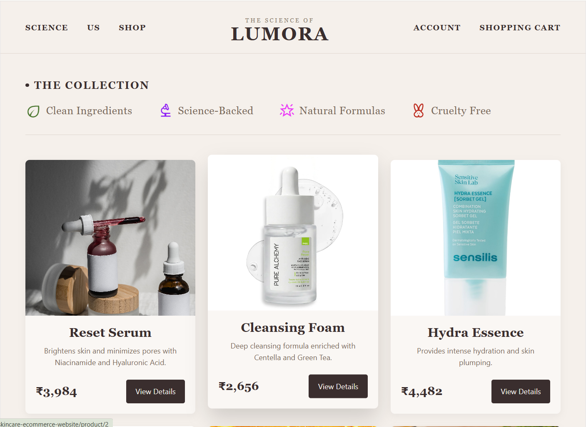
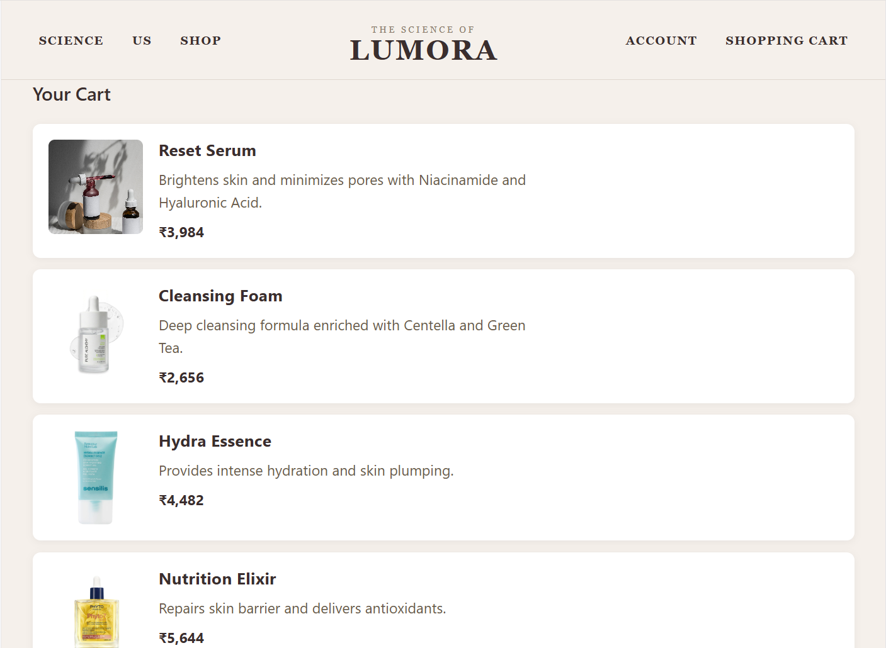

# ✨ Lumora – Skincare E-Commerce Website

A modern and elegant skincare e-commerce website built with **React**, **Vite**, and **Supabase**, designed to provide a premium beauty shopping experience with real-time cart functionality, clean UI, and luxury-inspired design.

## 📌 Project Overview

Lumora is a front-end + backend-integrated e-commerce web application that focuses on aesthetic design, responsive layouts, and real-time data handling using Supabase.

The project simulates a real-world skincare shopping platform with product browsing, product details, and a dynamic shopping cart system.

## 🔗 Live Demo

[View Website](https://niharika-malankar.github.io/skincare-ecommerce-website/)

## 🚀 Features

* Responsive Navigation Bar
* Luxury Hero Section with Model Banner
* Product Collection Showcase
* Interactive Product Cards with Hover Effects
* Product Detail Page
* Real-Time Shopping Cart (Supabase)
* Live Cart Updates (no refresh needed)
* INR Currency Conversion (₹ format)
* Clean Ingredient & Brand Feature Section
* Newsletter Subscription UI
* Modern Footer Design
* Premium Skincare Branding & Typography

## 🛠 Technologies Used

* React.js
* JavaScript (ES6+)
* Vite
* React Router DOM
* Supabase (Database + Realtime)
* HTML5
* Inline CSS Styling
* Google Fonts (Cormorant Garamond)

## 📂 Project Structure

src/
├── components/
│   ├── Navbar.jsx
│   ├── component2.jsx (Hero Section)
│   ├── component3.jsx (Collection Section)
│   ├── component4.jsx (Product Cards)
│   ├── component5.jsx (Footer)
│
├── pages/
│   ├── Home.jsx
│   └── ProductPage.jsx
│
├── data/
│   └── products.js
│
├── supabase.js
├── App.jsx
└── main.jsx

## Screenshots

### Home Page

### Product Collection

### My Cart

### Footer

## 🛒 Cart System 
* Products are stored in Supabase database (cart table)
* Users can add products from Product Page
* Cart updates automatically using Supabase Realtime
* Cart is displayed on Home Page
* Currency displayed in Indian Rupees (₹)

## 🎨 Design Highlights

* Luxury skincare-inspired color palette
* Elegant serif typography
* Smooth hover animations
* Minimal and premium UI style
* High-quality product presentation
* Consistent branding across all pages

## ⚙️ Future Improvements

* User authentication (login system)
* Personal cart per user
* Cart quantity update & remove button
* Checkout page
* Payment gateway integration
* Mobile-first optimization improvements

## Author
Niharika Malankar

Built as a React + Supabase project to demonstrate:

* Component-based architecture
* Real-time database integration
* Modern UI/UX design
* Full e-commerce frontend workflow